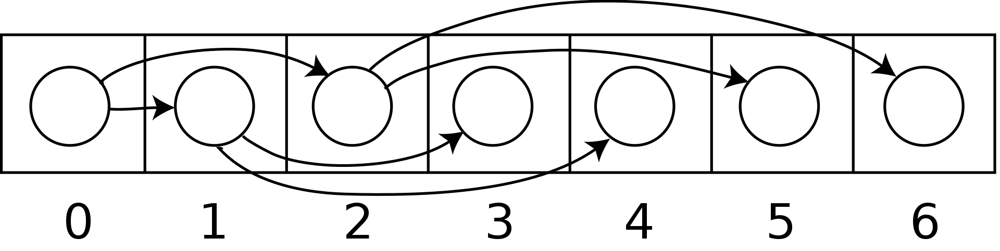
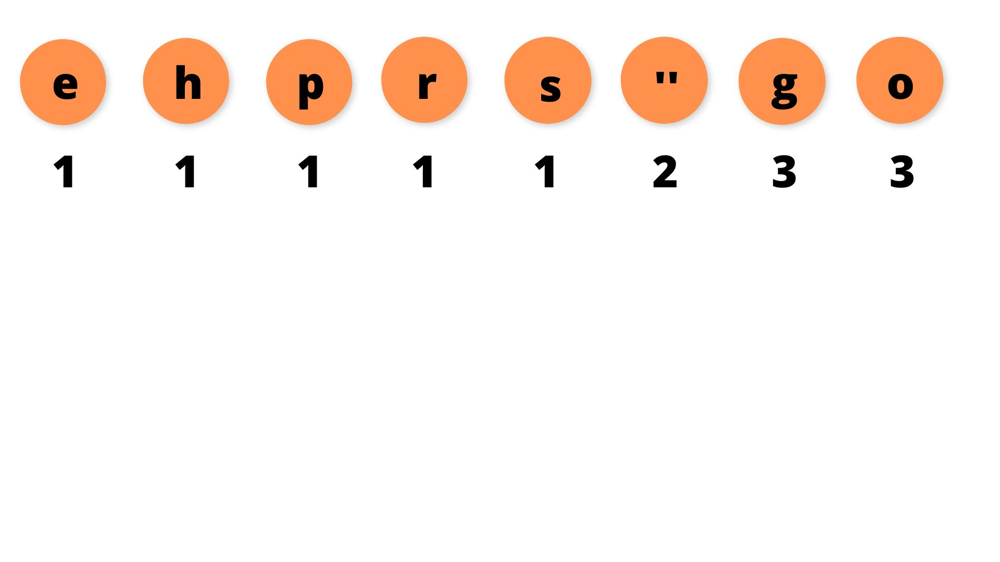
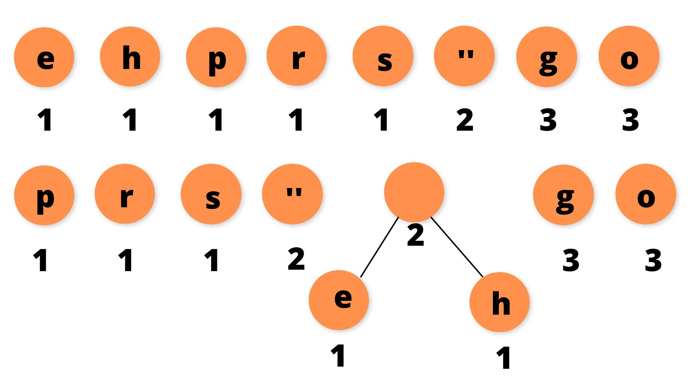
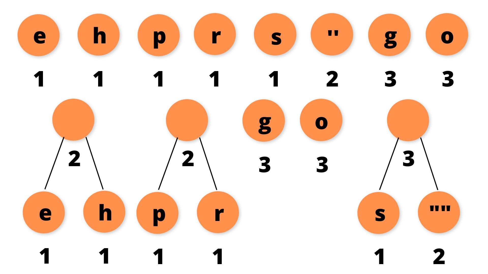
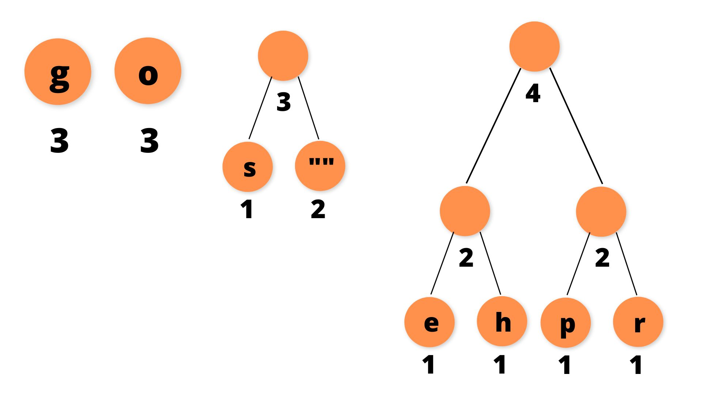
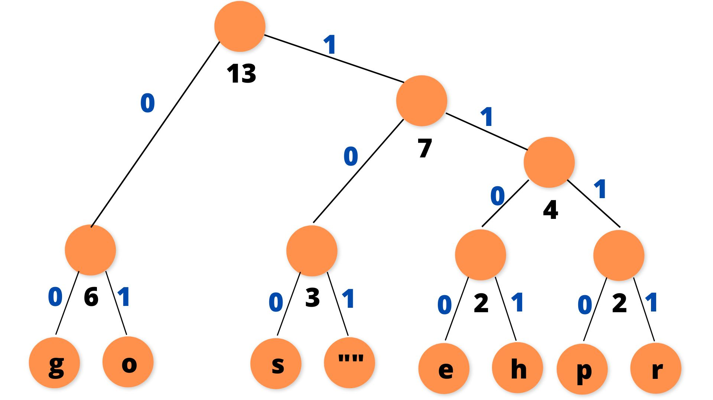

# **Learnings**

## **Learnings of project**

- ### 
**What is a binary Heap (min & max)**

  A binary heap is a tree-based data structure in which each node has at most two children and satisfies the **heap property**.  
  The **heap-property** requires that for a min-heap, the value of each node is greater than or equal to the value of its parent node (with minimum value at the root), and thus for a max-heap, the value of each node is less than or equal to the value of its parent node (max value at the root node).

  Binary Heaps are a common way to implement **priority queues**  

  <u>A binary heap, let's say that again, is created as a binary tree but with two additional constraints:</u>

  - **Shape Property**: A binary heap is a <i>complete binary-tree</i>, that is, all levels of the tree, except possibly the last one are fully filled, and, if the last level of tree is not complete, the nodes of that level are filled **from left to right**

  - **Heap property**: The key stored in each node is either greater than or equal to // or less than or equal to the key's in the node's children. (Either a max or min-heap respectively).

  The Heap is often implemented with an Array. Any binary tree can be stored in an array, but because binary heap is always a <i>complete binary tree</i>, it can be stored compactly, the parent and children of each node can be then found by arithmetic on array indices:
  Let N be the number of elements in the heap, and <i>i</i> an arbitraty (valid) index (between 0 and N - 1), then we can say for a given element <i>a</i> at index <i>i</i>:

  - Left Children at index 2<i>i</i> + 1
  - Right Children at index 2<i>i</i> + 2
  - Parent at index floor((i - 1) / 2)

Inserting an element into a binary heap involves adding the element to the end of the aray and then **re-ordering** the elements to satisfy the **heap property**.  
For example, to insert an element into a min-heap, the element is added to the end of the array, and then it is compared to its parent node, if smaller, it is swapped , and this process continues until heap property is satisfied.  
=> restoring heap property by comparing and possibly swap with parent node, is called <i>up-heap</i> operation ( also known as <i>bubble-up, sift-up, hepify-up</i>)

- ### 
**What is a priority queue**

  Priority queue is a data structure for storing a collection of elements, each one with an associated **priority** ( or a value if you prefer), that priority queue allows you to insert elements with their associated **priority**, and provides efficient methods to extract element with highest (or lowest) priority.

  The **binary heap**, can be used to implement such a priority queue (exactly what we do in this project)

  To recap => a priority queue is an abstract concept that defines the behavior of storing/retrieving elements based on their priorities, while a heap is a 'concrete' implementation of a priority queue that uses a binary tree structure and maintains the heap property to efficiently manage that concept of element's priorities.

  ### 
 **What is a Huffman code** 

  Huffman code is a famous **greedy algorithm** and its a particular kind of **optimal prefix code** used for lossless data compression  
  The main idea behind terrifying **Huffman Coding** concept, is that symbols that appears the more **often** will be encoded as **shorter-bit strings** while symbols that appears the **less** will be encoded as **longer-bits strings.**  
   
  Beware ! symbols/characters frequencies varies from one message to another, there is no Huffman coding that will work for all messages ! There is an algorithm for generating the Huffman code for a given message, which can be then used to decode only the same message.  
  Basic idea of the algorithm is to use a **frequency-sorted Binary tree**  

  **Must Know** => Huffman coding is a variable-length prefix coding algorithm, that assigns shorter bit-codes to more frequent characters, and longer bit-codes to less frequent characters

  ##### **Optimal prefix code ?**

  You certainly know ASCII or ANSI table, which are like "maps" where each character are mapped to a particular byte.  
  When you get a file in ANSI encoding, you know you have to read sets of 8 bits at a time and translate byte into characters.  
  Giving the **same number of bits** to represent each character simplifies decoding since we only need to read fix numbers of bits for translation, but it is **not optimal from size perspective** as => <i>often used characters get the "same" representation as rarely used characters </i>  

  That's why some encoding techniques uses a map-system where characters are mapped to bits of different sizes, More often characters are mapped to a smaller bits-code. WHen more often characters are mapped to shorter bits, you expect to encode the file with less space than classic encoding like ANSI/ASCII  
  Clever, smart, bravo ! but it comes with a challenge , how to know then where is the **marker, delimiter** how do you where a character begins/ends ? should I stop or should I go on ?  

  => One solution is to use a Binary Tree like the **Huffman Tree !**

  #### **Building the Huffman Tree**

  Main algorithm idea is as follow:

  - Scan your data and computes the frequency of occurence of each different byte character.

  - Insert them as nodes (symbol->data for byte character / symbol->freq for character frequencies) into a reverse priority queue  
    based on frequencies, the lowest frequency is given the highest priority.

  - Start a loop until the queue is empty.

  - Remove two nodes from the priority queue & combine them into an internal node with frequency = sum of the two nodes frequencies.

  - Insert the 2 nodes removed from the queue as respectively left & right child of created internal node.

  - Insert created internal node back into the queue.

  - The last remaining node on queue is the root of the Huffman Tree.

  - **In the Huffman Tree , we assign each left-edges a '0' - code, and each right-edges a '1' - code, that "trick" will then gives us the variable-encoding bits for each character stored at leaf nodes**

  

##### **Towards a Huffman Tree**

Given the string "go go gophers", the classic ASCII encoding requires 13 (characters) \* 8 (bits) = 104 bits.
Let's see if we can improve that....
First, we notice there is only 8 differents characters in the string "go go gophers", after building our Huffman Tree, all those characters will be stored as **leaves** of that Tree. How to give birth to that Tree ?  

We start with a forest of baby nodes, each one being a node storing a character with its associated frequency:

We pick two minimals nodes, here there are five "minimal" nodes with a frequency of **1**. (Notice we ordered our nodes in the order of a **reverse-priority queue**, the fewer the frequency, the highest the priority).  
With that two picked nodes, we create a new node with a frequency made of the sum of the picked nodes from the priority queue. The first picked becomes the left child of the new one, the second picked becomes the right child. Repeat this step until queue is empty, the steps are shown below:

  

  

  
Brrrr that tree is growing!!!
  
We complete the connection, assign each left edges a '0'path-code and each right edges a '1' path-code , which gives that final beauty:
  
  

  
  
From the tree, we can now retrieve the following coding table for the characters:

| character | Binary code |
| :-------: | :---------: |
|     g     |     00      |
|     o     |     01      |
|     s     |     100     |
|  "space"  |     101     |
|     e     |    1100     |
|     h     |    1101     |
|     p     |    1110     |
|     r     |    1111     |

 
We clearly that our most frequent character 'g' for example gets a shorter bit-string code. This table shows that writing "go go gophers" would require a total of **37 bits**, rather than **104 bits** with classic ASCII, saving around 60% of storage, without loosing any data/character. COngrats Sir Huffman

- **Compilation trick**

Flags -Iheap/ and -I/
=> -Iheap/ => This tells the compiler to include the directory named "heap/" in its research path for header files.
=> -I./ tells the compiler to include the current directory also in its search path for header files

Both of flags used to ensure that compiler finds the necessary header files for our source code, regardless of their relative locations.
